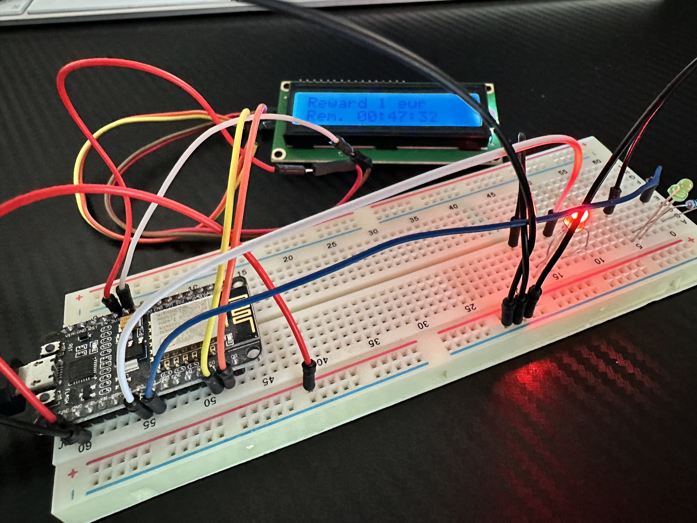
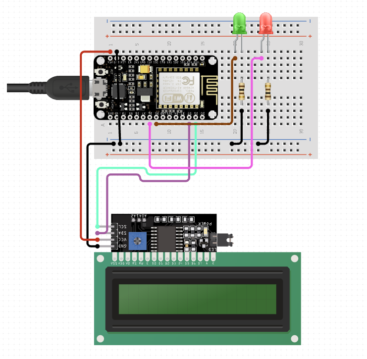

# NigMa

NigMa is connected hack toy designed for children who learn coding.

It is a connected vault that must be unlocked with a code, in order to get the reward it contains.

The game has a start date and a duration, and the amount of the reward decreases according to the time left.



## Hardware instructions

### Requirements

- A NodeMCU ESP8266 module (v1)
- A red LED
- A green LED
- 2x 110 ohm resistors
- A 1604 LCD module with I2C

### Wiring



## Software instructions

### Requirements

- [PlatformIO](https://platformio.org/) development environment (either full IDE or core /CLI)

### Setup

Before building, edit `config.h` file in the `include` folder to tune NigMa.

Then create a `secrets.h` file in the `include` to configure Wifi connection.

Here is an example `secrets.h`:

```c
#define WIFI_SSID "MySSID"
#define WIFI_PASSWORD "password"
```

## Usage

- Note the NigMa IP address (displayed for 3 seconds on device start)
- Connect to the IP with HTTP protocol (use a web browser for that) to see available endpoints